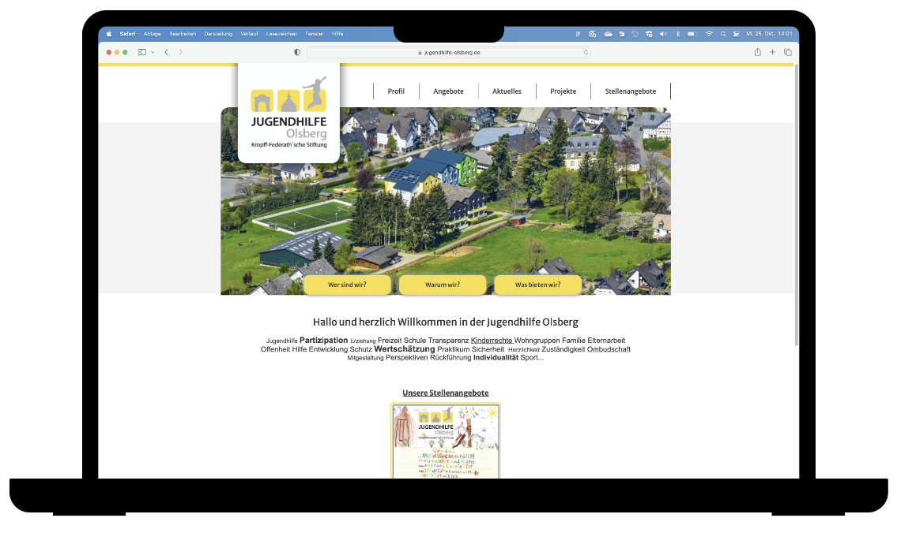

# Konzept - Einleitung

**Ein Messenger für die Jugendhilfe Olsberg**

Die Jugendhilfe Olsberg der Kropff-Federath´schen Stiftung ist eine Einrichtung, in der junge Menschen auf das zukünftige Leben vorbereitet werden. Sie bietet ein differenziertes Leistungsangebot für Kinder, Jugendliche, junge Erwachsene und Familien.

Aktuell steht die Jugendhilfe Olsberg vor der Herausforderung, einen passenden Messenger für den internen Austausch zu finden. Gemeinsam mit dir wollen wir das ändern und eine maßgeschneiderte Lösung schaffen, die den Arbeitsalltag der Mitarbeitenden nachhaltig erleichert.

