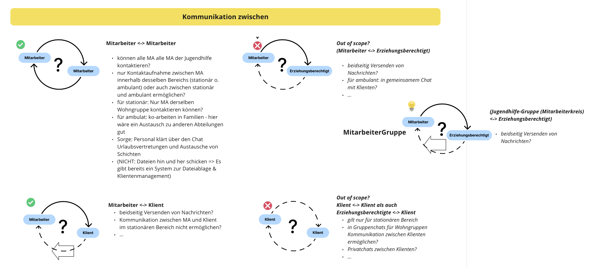

# Kommunikation zwischen

## Mitarbeiter <-> Mitarbeiter

- können alle MA alle MA der Jugendhilfe kontaktieren?
- nur Kontaktaufnahme zwischen MA innerhalb desselben Bereichs (stationär o. ambulant) oder auch zwischen stationär und ambulant ermöglichen?
- für stationär: Nur MA derselben Wohngruppe kontaktieren können?
- für ambulat: ko-arbeiten in Familien - hier wäre ein Austausch zu anderen Abteilungen gut
- Sorge: Personal klärt über den Chat Urlaubsvertretungen und Austausche von Schichten
- (NICHT: Dateien hin und her schicken => Es gibt bereits ein System zur Dateiablage & Klientenmanagement)

## Mitarbeiter <-> Klient

- beidseitig Versenden von Nachrichten?
- Kommunikation zwischen MA und Klient im stationären Bereich nicht ermöglichen?
- ...

## Mitarbeiter <-> Erziehungsberechtigt

*Out of scope: Feature!*

- beidseitig Versenden von Nachrichten?
- für ambulant: in gemeinsamem Chat mit Klienten?
- ...

## Klient <-> Klient als auch Erziehungsberechtigte <-> Klient

*Out of scope: Feature!*

- gilt nur für stationären Bereich
- in Gruppenchats für Wohngruppen Kommunikation zwischen Klienten ermöglichen?
- Privatchats zwischen Klienten?
- ...